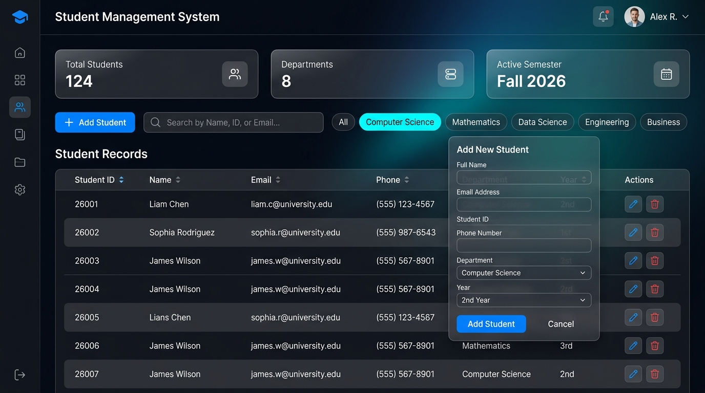
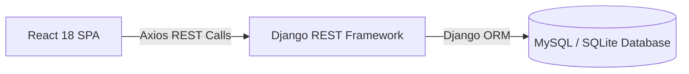

# 🎓 Student Management System

> **Full-Stack CRUD Web Application** — React 18 + Django REST Framework + MySQL / SQLite

[](https://python.org)
[](https://djangoproject.com)
[](https://www.django-rest-framework.org)
[](https://react.dev)
[](https://vitejs.dev)
[](https://mysql.com)
[](#-testing--verification)

---

## 🖼️ Application Screenshot



---

## 📌 Project Overview

The **Student Management System (SMS)** is a full-stack web application designed for educational institutions to streamline administrator management of student records. 

It provides an intuitive interface for full **CRUD (Create, Read, Update, Delete)** operations, debounced real-time searching, responsive data tables, client/server dual validation, and auto-dismissing toast notifications.



---

## ✨ Features & Functionality

| Feature | Description |
|---------|-------------|
| ➕ **Add Student** | Modal form with real-time client-side pattern checks and server-side DRF validation. |
| 📋 **Live Directory** | High-performance student table connected to real database records with instant sorting. |
| ✏️ **Edit Record** | Pre-populated update modal supporting full (`PUT`) and partial (`PATCH`) updates. |
| 🗑️ **Delete Record** | Confirmation dialog with instant backend deletion (`DELETE`). |
| 🔍 **Live Search** | Debounced search filtering across student names, emails, and academic departments. |
| 🛡️ **Dual-Layer Validation** | Client-side input format checks + server-side uniqueness & range validation rules. |
| 🔔 **Toast Feedback** | Auto-dismissing success, notification, and error alerts. |
| ⚡ **Unified Deployment** | Django serves both the REST API and the compiled React SPA from a single port. |

---

## 🛠️ Technology Stack

| Layer | Technology | Details |
|-------|------------|---------|
| **Frontend** | React 18, Vite, Axios | Modern SPA UI with Glassmorphic CSS styling |
| **Backend** | Python 3.10+, Django 4.2 | Robust MVC web framework & REST server |
| **API Layer** | Django REST Framework 3.15 | Serializers, ViewSets, CORS handling |
| **Database** | SQLite (Default) / MySQL 8.0+ | Configurable ORM data backend |
| **Config** | `python-decouple` | Safe `.env` configuration management |

---

## 🚀 Quick Start & Local Deployment

### 1. Prerequisites
- **Python 3.10+**
- **Git**

### 2. Quick Unified Deployment (Single Server)
```bash
# Clone the repository
git clone https://github.com/Keshavkarthikeyan07/student-management-system.git
cd student-management-system/backend

# Activate virtual environment (Windows)
.\venv\Scripts\activate
# (macOS/Linux: source venv/bin/activate)

# Install dependencies (if needed)
pip install -r requirements.txt

# Run migrations
python manage.py migrate

# Start the application server
python manage.py runserver 127.0.0.1:8000
```
✅ Open **[http://127.0.0.1:8000/](http://127.0.0.1:8000/)** in your browser to view the application!

---

## 🔌 API Endpoints Reference

| Method | Endpoint | Description | Status Code |
|--------|----------|-------------|-------------|
| `GET` | `/api/students/` | Fetch all student records | `200 OK` |
| `GET` | `/api/students/?search=...` | Search students by name/email/department | `200 OK` |
| `POST` | `/api/students/` | Create a new student record | `201 Created` |
| `GET` | `/api/students/{id}/` | Fetch single student details by ID | `200 OK` |
| `PUT` | `/api/students/{id}/` | Complete record update | `200 OK` |
| `PATCH` | `/api/students/{id}/` | Partial record update | `200 OK` |
| `DELETE` | `/api/students/{id}/` | Delete student record | `204 No Content` |

---

## 🧪 Testing & Verification

The system includes both automated unit tests and a live end-to-end CRUD verification suite:

### 1. Automated DRF Unit Tests
```bash
cd backend
python manage.py test students --verbosity=2
```
- **Results**: `19/19 test cases passed` (Testing model constraints, serializers, API views, validation, and HTTP status codes).

### 2. End-to-End Live CRUD Verification
```bash
cd backend
python verify_crud.py
```
- **Results**: `45/45 checks passed` (Verifies live API root, creation, listing, individual retrieval, search filtering, full update, partial patch, persistence, invalid input 400s, non-existent 404s, and deletion).

---

## 📁 Project Structure

```
student-management-system/
├── README.md
├── .gitignore
├── backend/
│   ├── manage.py
│   ├── requirements.txt
│   ├── verify_crud.py              ← Live 45-check test suite
│   ├── .env.example
│   ├── config/                     ← Django settings & URLs
│   │   ├── settings.py
│   │   └── urls.py
│   └── students/                   ← App logic (Models, Views, Serializers, Tests)
│       ├── models.py
│       ├── serializers.py
│       ├── views.py
│       └── tests.py
├── frontend/
│   ├── package.json
│   ├── dist/                       ← Compiled React SPA build
│   └── src/
│       ├── App.jsx
│       ├── index.css
│       ├── components/             ← Modal, Form, Table, Header, Toast
│       └── services/               ← Axios API client
└── docs/
    ├── screenshots/                ← UI Screenshot assets
    │   └── dashboard.jpg
    ├── API_DOCUMENTATION.md
    ├── ARCHITECTURE.md
    ├── DATABASE.md
    ├── TESTING.md
    └── PROJECT_REPORT.md
```

---

## 📚 Detailed Documentation

| Document | Content |
|----------|---------|
| 📖 [API Documentation](docs/API_DOCUMENTATION.md) | Full endpoint specs & JSON payload examples |
| 🏗️ [Architecture Guide](docs/ARCHITECTURE.md) | System components & data flow design |
| 🗄️ [Database Reference](docs/DATABASE.md) | Schema design, fields, & indexing |
| 🧪 [Testing Guide](docs/TESTING.md) | Automated & manual testing procedures |
| 📄 [Project Report](docs/PROJECT_REPORT.md) | Comprehensive academic project summary |

---

## 📄 License
Educational & Open Source Project — Created for **Student Management System** portfolio.
