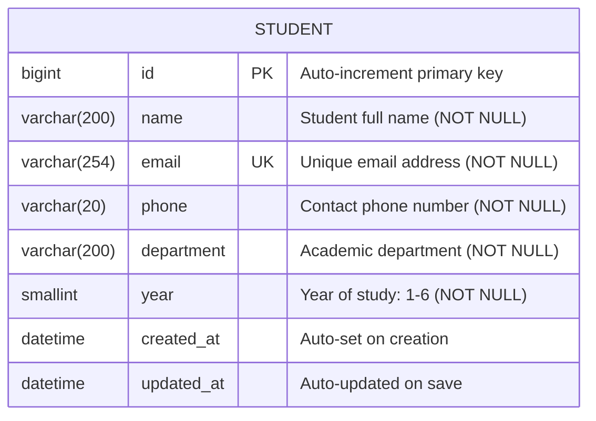

# 🗃️ Database Design — Student Management System

## Overview

The Student Management System uses a single **`students`** table in a MySQL 8.0 database. The table stores all student information and supports all CRUD operations through Django's ORM layer.

---

## Database Configuration

| Setting       | Value                      |
|---------------|----------------------------|
| DBMS          | MySQL 8.0+                 |
| Database Name | `student_management_db`    |
| Character Set | `utf8mb4`                  |
| Collation     | `utf8mb4_unicode_ci`       |
| ORM           | Django ORM (via mysqlclient)|

---

## ER Diagram



> **Note:** This is a single-entity system. Future enhancements could add `Department`, `Course`, and `User` tables with foreign key relationships.

---

## Table Schema

### `students` Table

```sql
CREATE TABLE `students` (
  `id`           BIGINT NOT NULL AUTO_INCREMENT,
  `name`         VARCHAR(200)   NOT NULL,
  `email`        VARCHAR(254)   NOT NULL UNIQUE,
  `phone`        VARCHAR(20)    NOT NULL,
  `department`   VARCHAR(200)   NOT NULL,
  `year`         SMALLINT UNSIGNED NOT NULL,
  `created_at`   DATETIME(6)    NOT NULL,
  `updated_at`   DATETIME(6)    NOT NULL,
  PRIMARY KEY (`id`)
) ENGINE=InnoDB DEFAULT CHARSET=utf8mb4 COLLATE=utf8mb4_unicode_ci;
```

---

## Field Reference

| Field        | Data Type              | Nullable | Default          | Constraints                     |
|--------------|------------------------|----------|------------------|---------------------------------|
| id           | BIGINT AUTO_INCREMENT  | No       | Auto             | PRIMARY KEY                     |
| name         | VARCHAR(200)           | No       | —                | NOT NULL                        |
| email        | VARCHAR(254)           | No       | —                | NOT NULL, UNIQUE                |
| phone        | VARCHAR(20)            | No       | —                | NOT NULL                        |
| department   | VARCHAR(200)           | No       | —                | NOT NULL                        |
| year         | SMALLINT UNSIGNED      | No       | —                | NOT NULL, CHECK (1 ≤ year ≤ 6) |
| created_at   | DATETIME(6)            | No       | (auto)           | Set once on INSERT              |
| updated_at   | DATETIME(6)            | No       | (auto)           | Updated on every UPDATE         |

---

## Indexes

| Index Name       | Column | Type    | Purpose                       |
|------------------|--------|---------|-------------------------------|
| PRIMARY          | id     | PRIMARY | Unique row identifier         |
| students_email   | email  | UNIQUE  | Enforces unique email per student |

---

## Django Model Definition

```python
class Student(models.Model):
    name       = models.CharField(max_length=200)
    email      = models.EmailField(unique=True, max_length=254)
    phone      = models.CharField(max_length=20)
    department = models.CharField(max_length=200)
    year       = models.PositiveSmallIntegerField()
    created_at = models.DateTimeField(auto_now_add=True)
    updated_at = models.DateTimeField(auto_now=True)

    class Meta:
        db_table = "students"
        ordering = ["-created_at"]
```

---

## CRUD SQL Operations

### CREATE (INSERT)

```sql
INSERT INTO students (name, email, phone, department, year, created_at, updated_at)
VALUES ('Alice Johnson', 'alice@example.com', '+91-9876543210', 'Computer Science', 2, NOW(), NOW());
```

### READ (SELECT ALL)

```sql
SELECT * FROM students ORDER BY created_at DESC;
```

### READ (SELECT ONE)

```sql
SELECT * FROM students WHERE id = 1;
```

### READ (SEARCH)

```sql
SELECT * FROM students
WHERE name LIKE '%alice%'
   OR email LIKE '%alice%'
   OR department LIKE '%alice%'
ORDER BY created_at DESC;
```

### UPDATE

```sql
UPDATE students
SET name='Alice Updated', department='Data Science', year=3, updated_at=NOW()
WHERE id = 1;
```

### DELETE

```sql
DELETE FROM students WHERE id = 1;
```

---

## Database Setup Instructions

### Step 1: Start MySQL

```bash
# Windows (MySQL installed as a service)
net start mysql

# Or open MySQL Workbench / command line client
```

### Step 2: Create Database and User

```sql
-- Log in as root
mysql -u root -p

-- Create the database
CREATE DATABASE student_management_db
  CHARACTER SET utf8mb4
  COLLATE utf8mb4_unicode_ci;

-- Optional: Create a dedicated user (recommended)
CREATE USER 'sms_user'@'localhost' IDENTIFIED BY 'your_secure_password';
GRANT ALL PRIVILEGES ON student_management_db.* TO 'sms_user'@'localhost';
FLUSH PRIVILEGES;

-- Verify
SHOW DATABASES;
```

### Step 3: Configure .env

```env
DB_NAME=student_management_db
DB_USER=sms_user
DB_PASSWORD=your_secure_password
DB_HOST=127.0.0.1
DB_PORT=3306
```

### Step 4: Run Django Migrations

```bash
cd backend
venv\Scripts\activate    # Windows
python manage.py migrate
```

Django will execute the migration and create the `students` table automatically.

### Step 5: Verify Table Created

```sql
USE student_management_db;
SHOW TABLES;
DESCRIBE students;
```

---

## Backup and Restore

### Backup

```bash
mysqldump -u root -p student_management_db > backup.sql
```

### Restore

```bash
mysql -u root -p student_management_db < backup.sql
```

---

## Sample Data (for testing)

```sql
INSERT INTO students (name, email, phone, department, year, created_at, updated_at) VALUES
('Alice Johnson',  'alice@example.com',   '+91-9876543210', 'Computer Science',  2, NOW(), NOW()),
('Bob Smith',      'bob@example.com',     '5550200',        'Mathematics',        3, NOW(), NOW()),
('Carol Davis',    'carol@example.com',   '+44-7700900001', 'Electronics',        1, NOW(), NOW()),
('David Lee',      'david@example.com',   '07700123456',    'Civil Engineering',  4, NOW(), NOW()),
('Emma Wilson',    'emma@example.com',    '+1-555-0199',    'Business Administration', 2, NOW(), NOW());
```
